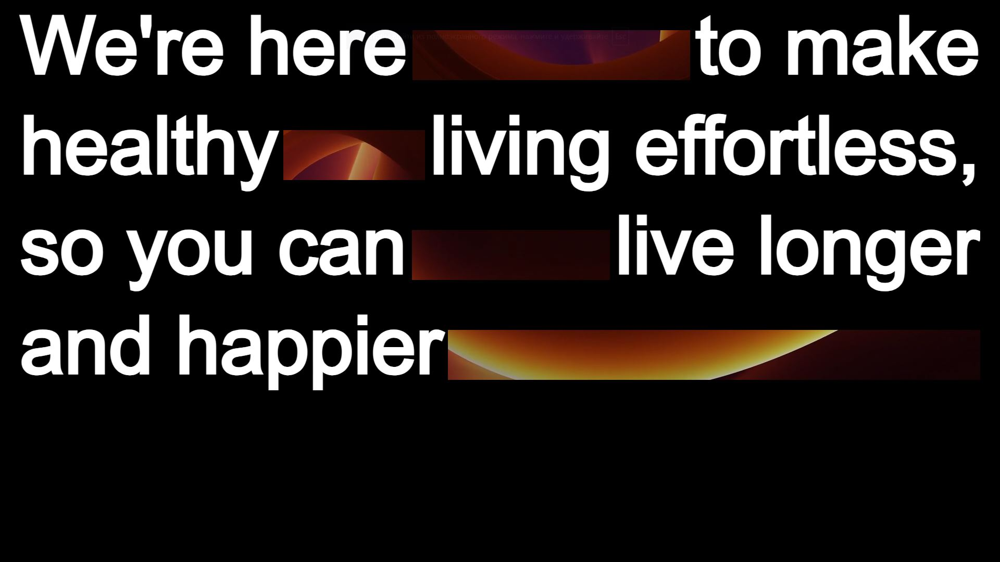

# Проект "Video Project" – Видеофон и Адаптивный Текст

## О проекте

Это одностраничный лендинг с видеофоном и анимированной типографикой, разработанный как визуально привлекательная вступительная секция сайта. Цель проекта — донести миссию бренда: "Сделать здоровый образ жизни простым и доступным для каждого".

Проект реализует современный подход к дизайну пользовательского интерфейса, с акцентом на эстетику, анимации и адаптивность для разных устройств. Текст на видео подстраивается под размеры экрана — есть отдельная разметка для десктопов и планшетов.

## Превью проекта



## Ссылка на демо

- [Посмотреть проект онлайн](https://video-project-phi.vercel.app/)

## Статус проекта

Проект завершен.

## Функциональность

- **Видеофон**: На заднем плане проигрывается зацикленное видео без звука.
- **Адаптивный текст**: Разные текстовые блоки для десктопной и планшетной версий.
- **Анимация текста**: Используются CSS-анимации и эффекты для плавного появления текста.
- **Поддержка всех устройств**: Проект оптимизирован под разные экраны и разрешения.

## Технологии и инструменты

- **HTML5** — Разметка страницы с акцентом на читаемость и структуру.
- **CSS3** — Стилизация, адаптивность, анимации.
- **Flexbox** — Упрощает компоновку текстовых блоков.
- **БЭМ (Блок-Элемент-Модификатор)** — Методология организации CSS-классов.
- **Media Queries** — Используются для адаптивного отображения контента.
- **Видео (MP4)** — Видео проигрывается через `<video>` с параметрами autoplay, muted и loop.

## Как запустить проект локально

1. Клонируйте репозиторий:
  ```bash
  git clone https://github.com/kirill-io/video-project.git
  ```

2. Перейдите в директорию проекта:
  ```bash
  cd video-project
  ``` 
3. Откройте файл index.html в браузере или используйте расширение Live Server в редакторе кода (например, VS Code).
